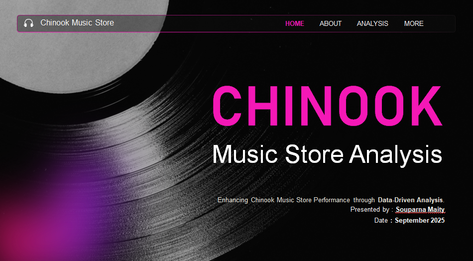

Chinook Music Store – SQL Analysis Project

📌 Project Overview

This project performs advanced SQL analysis on the Chinook Music Store database to extract actionable business insights related to sales performance, customer behavior, and revenue distribution.

Using real-world transactional data, the analysis answers key business questions about top customers, genre popularity, regional revenue trends, and operational performance.

🎯 Business Objectives

Identify top-performing customers and revenue drivers

Analyze genre-level and artist-level sales performance

Evaluate revenue distribution by country and region

Measure customer churn and inactivity patterns

Assess purchasing behavior and customer lifetime value trends

🛠 Technologies Used

SQL (MySQL)

MySQL Workbench

Chinook Sample Database

🔍 Key Insights
👥 Top Customers

Revenue is highly concentrated among a small percentage of customers.

Repeat buyers contribute significantly higher lifetime value.

🎶 Popular Genres

Rock, Metal, and Pop generate the majority of revenue.

Sales are concentrated in a few dominant albums and artists.

🌍 Sales by Country

USA drives the largest revenue share.

Emerging markets show different churn and purchasing behavior patterns.

📊 Employee Performance

Identified sales contributions by support representatives.

Highlighted performance variations across staff.

🧾 Invoice & Track Analysis

Determined top-selling tracks and albums.

Calculated revenue contribution per invoice and per customer.

🚀 Skills Demonstrated

Multi-table JOIN operations

CTEs (WITH clauses)

Window functions (RANK, ROW_NUMBER)

Aggregation & revenue calculations

Customer segmentation logic

Churn & recency analysis

Business-driven SQL storytelling

📈 Future Enhancements

Visualize insights using Power BI or Excel dashboards

Build churn prediction model

Develop Customer Lifetime Value (CLV) model

Add time-series revenue trend analysis

📜 License

This project is for educational and portfolio purposes only.
